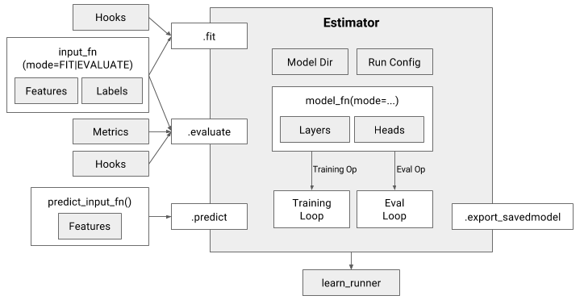

# Best practices in TensorFlow (how to use the Estimator and Experiments API)

Image taken from https://arxiv.org/abs/1708.02637

Image taken from https://arxiv.org/abs/1708.02637

## References

### Blog posts

+ Great introductory post by Peter Roelants [Higher-Level APIs in TensorFlow](https://medium.com/onfido-tech/higher-level-apis-in-tensorflow-67bfb602e6c0).

### Papers

+ Cheng, H.-T. et al. (2017). 
TensorFlow Estimators: Managing Simplicity vs. Flexibility in High-Level Machine Learning Frameworks. https://doi.org/10.1145/3097983.3098171 http://arxiv.org/abs/1708.02637
